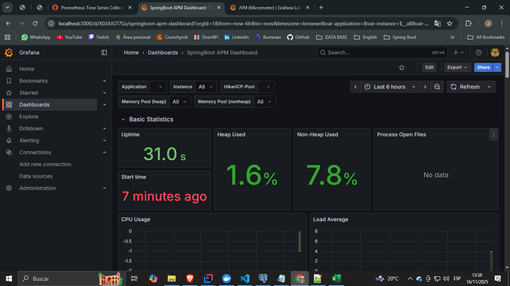

# Monitoring Stack

Stack completo de monitoreo y observabilidad para el sistema de microservicios.

## Descripción
El stack de monitoreo incluye herramientas para métricas, logs, alertas y visualización:

- **Prometheus**: Recolección y almacenamiento de métricas
- **Grafana**: Dashboards y visualización de datos
- **Configuraciones**: Archivos de configuración para Prometheus y componentes adicionales

## Herramientas de Monitoreo

### Prometheus (Puerto 9090)
- **Función**: Recolección de métricas de todos los microservicios
- **URL**: http://localhost:9090
- **Configuración**: `monitoring/prometheus.yml`

### Grafana (Puerto 3000)
- **Función**: Dashboards y visualización de métricas
- **URL**: http://localhost:3000
- **Credenciales**: admin/admin
- **Data Source**: Prometheus

## Configuraciones

### Prometheus Configuración

#### Servicios Monitoreados
| Servicio | Puerto | Endpoint Métricas |
|----------|--------|-------------------|
| **Prometheus** | 9090 | /metrics |
| **MS Pedidos** | 8082 | /actuator/prometheus |
| **MS Productos V2** | 8083 | /actuator/prometheus |
| **Gateway** | 8080 | /actuator/prometheus |
| **Config Server** | 8888 | /actuator/prometheus |
| **Registry Service** | 8761 | /actuator/prometheus |

#### Métricas Recolectadas
- **JVM**: Memoria, GC, threads
- **HTTP**: Latencia, throughput, códigos de estado
- **Base de Datos**: Conexiones, queries
- **Microservicios**: Health checks, tiempos de respuesta

---

## 📊 Dashboard – Spring Boot APM (Grafana)

---

##  ¿Qué muestra este dashboard?

Este panel de Grafana permite visualizar métricas clave del microservicio:

### ✔ Métricas del sistema
- **Uptime:** Tiempo total que el servicio ha permanecido activo.
- **Start time:** Momento en el que el servicio se inició.
- **CPU Usage:** Porcentaje de uso del CPU por la aplicación.
- **Load Average:** Nivel de carga del sistema.

### ✔ Métricas de memoria (JVM)
- **Heap Used:** Memoria Heap usada por la JVM.
- **Non-Heap Used:** Memoria usada para clases, metadata y estructuras internas.
- **Memory Pool (heap / non-heap):** Distribución detallada del uso de memoria.

### ✔ Métricas del pool de conexiones (HikariCP)
- Cantidad de conexiones activas.
- Conexiones en espera.
- Uso total del pool.

### ✔ Otros indicadores
- **Process Open Files:** Cantidad de archivos abiertos por el proceso.
- Estadísticas generales de la JVM.

---
